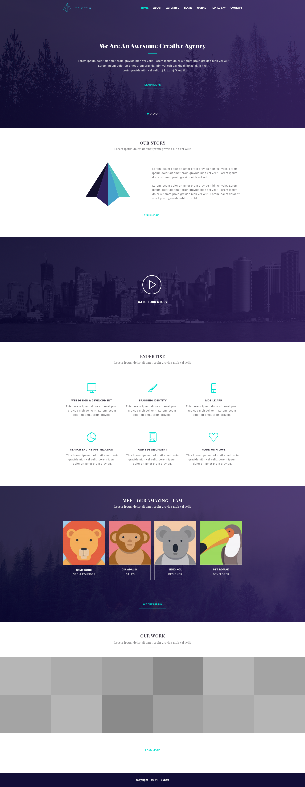

# Syntra examen

## SASS

The SASS exam on June 19, 2021 consisted of the assignment to make a pixel-perfect reproduction of the below design using scss and to find nice responsive solutions for tablet and mobile. We were given six hours to do this.

**_Deployment via surge:_**

[https://syntra-examensass.surge.sh](https://syntra-examensass.surge.sh)

**_Design_**

